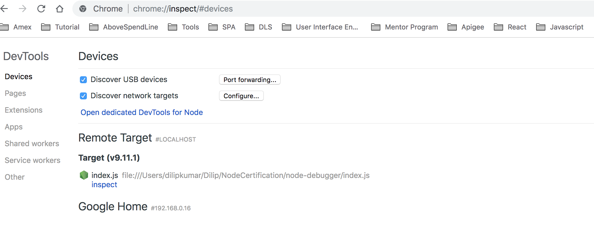

# Start node process in debugger mode?
```
node debug index.js
```

# Start debugger with Chrome browser
```
node --inspect --debug-brk index.js
```
Then run `about:inspect` to open Chrome browser. After that click on `inspect`. Following is sample screen shot.

